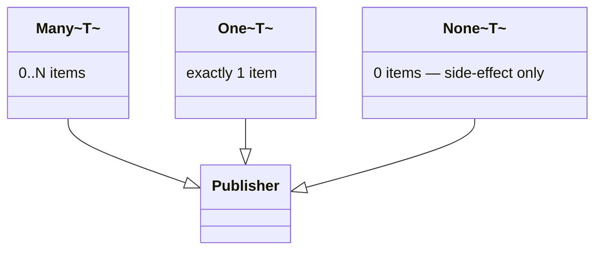
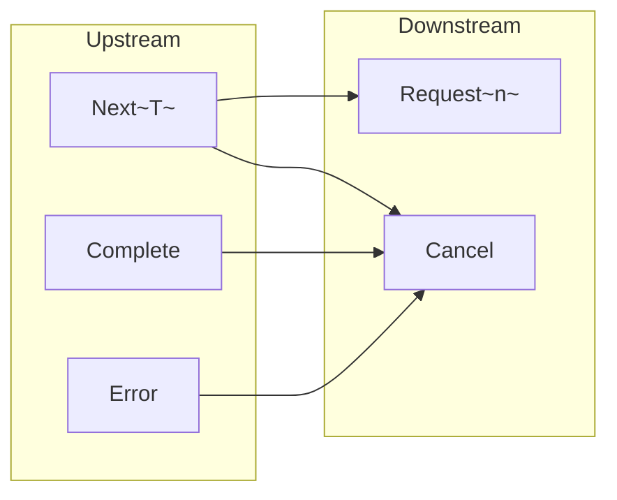
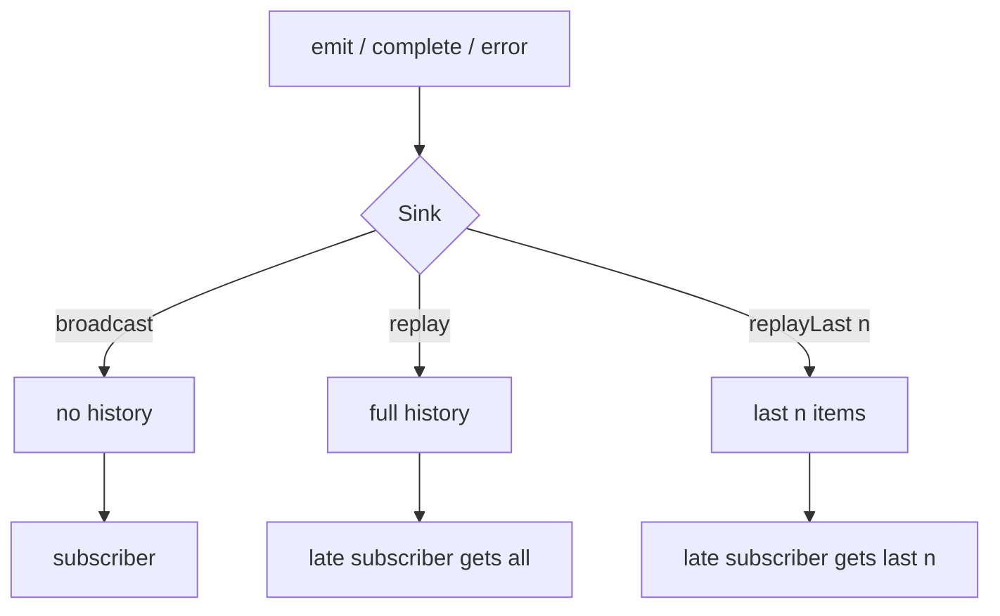

# ≋ aelv

Minimalistic reactive streams for Kotlin. Implements the [Reactive Streams](https://www.reactive-streams.org/) specification on top of Kotlin coroutines.

## Install

```kotlin
// build.gradle.kts
repositories {
    maven {
        url = uri("https://maven.pkg.github.com/OyabunAB/aelv")
        credentials {
            username = System.getenv("GITHUB_ACTOR")
            password = System.getenv("GITHUB_TOKEN")
        }
    }
}

dependencies {
    implementation("se.oyabun:aelv:1.0.0-rc.1")
}
```

## Types

Three publisher types, each cold and backpressure-aware:



```kotlin
val items: Many<Int>  = Many.of(1, 2, 3)
val single: One<Int>  = One.defer { fetchFromDb() }
val effect: None<Unit> = None.defer { db.commit() }
```

## Signals

Every interaction between producer and consumer flows through `Signal`:



## Operators

### Many

| Category | Operators |
|---|---|
| Transform | `map` `mapNotNull` `filter` `take` `takeWhile` `skip` `skipWhile` `distinct` `distinctUntilChanged` `distinctUntilChangedBy` |
| Expand | `flatMap` `concatMap` `flatMapSequential` `switchMap` |
| Combine | `merge` `mergeWith` `concat` `zip` `combineLatest` `takeUntilOther` `delaySubscription` |
| Buffer | `buffer(size)` `buffer(size, skip)` `bufferTimeout` |
| Group | `groupBy` |
| Side-effect | `doOnNext` `doOnComplete` `doOnError` `doOnSubscribe` `doFinally` |
| Error | `recover` `recoverWith` `retry(n)` `retry(Policy)` `onBackpressureDrop` |
| Context | `publishOn` `subscribeOn` |
| Terminal | `fold` `reduce` `toList` `toSet` `first` `last` `drain` `subscribe` |

### One

`map` `flatMap` `flatMapMany` `flatMapNone` `zipWith` `recover` `retry` `doOnNext` `doOnError` `doFinally` `publishOn` `subscribeOn` `get` `cache`

### zip

```kotlin
zip(One.of(1), One.of("a")) { n, s -> "$n$s" }  // One<String> → "1a"
```

## Sink

Hot multicast push source. Three variants:



```kotlin
val sink = Sink.broadcast<Int>()
sink.asMany().filter { it > 0 }.subscribe(...)
sink.emit(1)
sink.complete()
```

## Retry

```kotlin
Many.of(...)
    .retry(
        Policy.retry()
            .on(TimeoutException::class)
            .withBackoff(100.milliseconds, 10.seconds)
            .maxAttempts(5)
    )
```

`Backoff` options: `None`, `Fixed(delay)`, `Exponential(initial, max, factor, jitter)`.

## Error handling

All errors are `AelvException`. Terminal operations return `Either<T, AelvException>` — no exceptions thrown at call sites.

```kotlin
when (val result = stream.toList().get()) {
    is Either.Left  -> process(result.value)
    is Either.Right -> handleError(result.value)
}
```

## Verify

Test DSL included in the main artifact:

```kotlin
Verify.that(publisher)
    .isSubscribed()
    .runs { source.emit(1) }
    .emitsNext(1)
    .completesNormally()
```

## RS Compliance

TCK-verified. `Many` passes all applicable RS Publisher specs. `One` passes all single-element specs.
