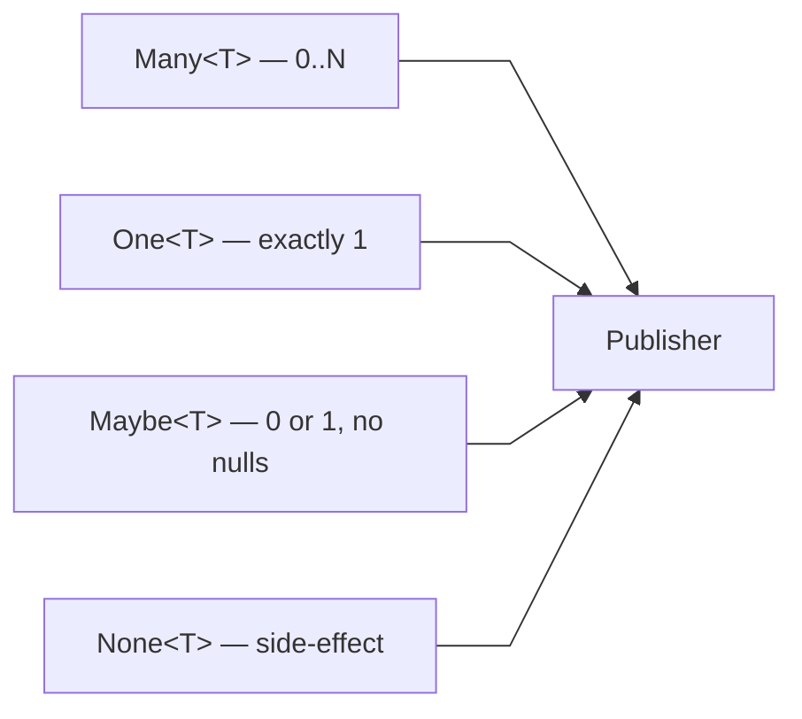
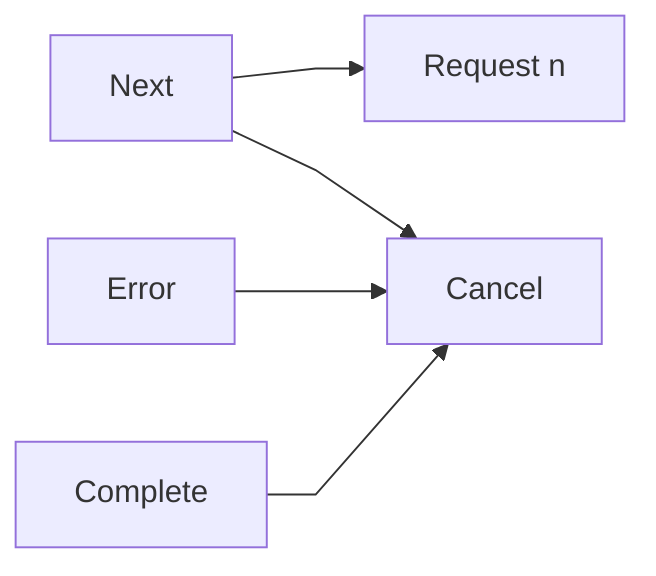
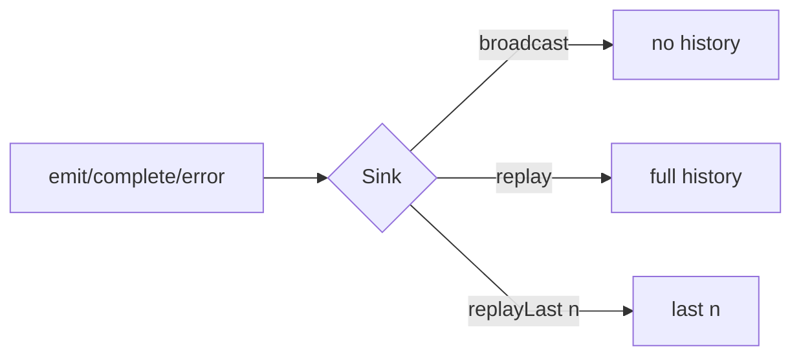

# ≋ aelv

Minimalistic reactive streams for Kotlin. Implements the [Reactive Streams](https://www.reactive-streams.org/) specification on top of Kotlin coroutines.

## Requirements

- Kotlin 2.x
- JVM 21+
- GitHub Packages credentials (`GITHUB_ACTOR` / `GITHUB_TOKEN`)

## Install

```kotlin
// build.gradle.kts
repositories {
    maven {
        url = uri("https://maven.pkg.github.com/OyabunAB/aelv")
        credentials {
            username = System.getenv("GITHUB_ACTOR")
            password = System.getenv("GITHUB_TOKEN")
        }
    }
}

dependencies {
    implementation("se.oyabun:aelv:1.0.0-rc.7")
}
```

## Types

Four publisher types, each cold and backpressure-aware:



```kotlin
val items: Many<Int>    = Many.items(1, 2, 3)
val single: One<Int>    = One.defer { fetchFromDb() }
val maybe: Maybe<Int>   = Maybe.defer { findOrNull() }
val effect: None<Unit>  = None.defer { db.commit() }
```

`Maybe<T>` emits either one item or completes empty — never null, never more than one element.

## Signals

Every interaction between producer and consumer flows through `Signal`:



## Operators

### Many

| Category | Operators |
|---|---|
| Transform | `map` `mapNotNull` `filter` `take` `takeWhile` `skip` `skipWhile` `distinct` `distinctUntilChanged` `distinctUntilChangedBy` |
| Expand | `flatMap` `flatMapOne` `flatMapNone` `concatMap` `flatMapSequential` `switchMap` |
| Combine | `merge` `mergeWith` `concat` `zip` `combineLatest` `takeUntilOther` `delaySubscription` |
| Buffer | `buffer(size)` `buffer(size, skip)` `bufferTimeout` |
| Group | `groupBy` |
| Side-effect | `doOnNext` `doOnComplete` `doOnError` `doOnSubscribe` `doFinally` |
| Error | `recover` `recoverWith` `retry(n)` `retry(Policy)` `onBackpressureDrop` |
| Context | `publishOn` `subscribeOn` |
| Terminal | `fold` `reduce` `toList` `toSet` `first` `firstMaybe` `last` `drain` `subscribe` |

`flatMap(T -> Many<R>)` — standard fan-out, returns `Many<R>`  
`flatMapOne(T -> One<R>)` — each element maps to exactly one, returns `Many<R>`  
`flatMapNone(T -> None<R>)` — each element triggers a side-effect, returns `None<R>`

### One

| Category | Operators |
|---|---|
| Transform | `map` `flatMap` `flatMapMany` `flatMapMaybe` `flatMapNone` |
| Combine | `zipWith` |
| Side-effect | `doOnNext` `doOnError` `doFinally` |
| Error | `recover` `retry(n)` `retry(Policy)` |
| Context | `publishOn` `subscribeOn` |
| Terminal | `await` `cache` |

`flatMap(T -> One<R>)` — returns `One<R>`  
`flatMapMany(T -> Many<R>)` — returns `Many<R>`  
`flatMapMaybe(T -> Maybe<R>)` — returns `Maybe<R>`  
`flatMapNone(T -> None<R>)` — returns `None<R>`

### Maybe

| Category | Operators |
|---|---|
| Transform | `map` `filter` `flatMap` `flatMapMany` `flatMapNone` |
| Side-effect | `doOnNext` `doOnComplete` `doOnError` `doFinally` |
| Error | `recover` `retry(n)` `retry(Policy)` |
| Context | `publishOn` `subscribeOn` |
| Terminal | `await` `or` `toOne` |

`flatMap(T -> Maybe<R>)` — returns `Maybe<R>`  
`flatMapMany(T -> Many<R>)` — returns `Many<R>`  
`flatMapNone(T -> None<R>)` — returns `None<R>`

### None

| Category | Operators |
|---|---|
| Chain | `then(() -> One<R>)` `then(() -> Maybe<R>)` `then(() -> Many<R>)` `then(() -> None<R>)` |
| Terminal | `await` |

`then` chains a subsequent publisher that runs after the side-effect completes, returning the appropriate type.

### zip

```kotlin
zip(One.single(1), One.single("a")) { n, s -> "$n$s" }  // One<String> → "1a"
```

## Conversions

| Expression | Result |
|---|---|
| `one.toMaybe()` | `Maybe<T>` — wraps the single value |
| `one.toMany()` | `Many<T>` — stream of one element |
| `many.firstMaybe()` | `Maybe<T>` — first element or empty |
| `none.toMany()` | `Many<T>` — empty stream after effect completes |

```kotlin
val maybeUser: Maybe<User> = One.defer { db.findUser(id) }.toMaybe()
val firstHit: Maybe<Result> = results.firstMaybe()
```

## Sink

Hot multicast push source. Three variants:



```kotlin
val sink = Sinks.broadcast<Int>()
sink.asMany().filter { it > 0 }.subscribe(...)
sink.emit(1)
sink.complete()
```

## Retry

```kotlin
Many.items(1, 2, 3)
    .retry(
        Policy.retry()
            .on(TimeoutException::class)
            .withBackoff(100.milliseconds, 10.seconds)
            .maxAttempts(5)
    )
```

`Backoff` options: `None`, `Fixed(delay)`, `Exponential(initial, max, factor, jitter)`.

## Error handling

Terminal operations return `Either<Exception, T>` — no exceptions thrown at call sites. `Failure` carries the error, `Success` carries the value.

```kotlin
when (val result = stream.toList().await()) {
    is Success -> process(result.value)
    is Failure -> handleError(result.value)
}
```

## Verify

Test DSL included in the main artifact:

```kotlin
Verify.that(publisher)
    .emitsNext(1, 2, 3)
    .completesNormally()

// assert individual items
Verify.that(publisher)
    .assertNext { assertEquals(1, it) }
    .completesNormally()

// empty completion
Verify.that(maybePublisher).completesEmpty()

// error assertions
Verify.that(publisher).failedWith<TimeoutException>()
```

| Method | Applicable to |
|---|---|
| `completesNormally()` | Many, One, Maybe, None |
| `completesEmpty()` | Maybe, Many |
| `emitsNext(vararg values)` | Many, One |
| `assertNext { predicate }` | Many, One, Maybe |
| `emitsCount(n)` | Many |
| `aborted()` | Many, One, Maybe, None |
| `failed()` | Many, One, Maybe, None |
| `failedWith<X>()` | Many, One, Maybe, None |
| `timesOut()` | Many, One, Maybe |

## RS Compliance

TCK-verified. `Many` passes all applicable RS Publisher specs. `One` passes all single-element specs.

## Performance

aelv implements a synchronous fusion protocol for fused pipelines — when the entire chain from
source to terminal is synchronous, the coroutine callback machinery is bypassed in favour of a
tight poll loop. On fused benchmarks RxJava currently leads; aelv is competitive and ahead of
Mutiny and Reactor on all fused operations. aelv ties RxJava on `concatMap` and leads all
libraries on deep recursive flat-map due to its work-deque interpreter (O(1) JVM stack depth).

| Benchmark | aelv | RxJava | Mutiny | Reactor | Monix |
|---|---:|---:|---:|---:|---:|
| baseline_toList | 92 | **165** | 119 | 49 | 30 |
| map_toList | 76 | **114** | 61 | 46 | 26 |
| filter_toList | 125 | **208** | 91 | 81 | 32 |
| take_toList | 211 | **223** | 98 | 96 | 34 |
| fold_sum | 101 | **154** | 97 | 48 | 42 |
| chain (map→filter→take) | 170 | **277** | 134 | 98 | 36 |
| concatMap_toList | **69** | **69** | 77 | 58 | 32 |
| flatMap_concurrent | 20 | **99** | 40 | 55 | 28 |

*ops/ms on 1000 items, JMH throughput mode, OpenJDK 21, Intel i9-8950HK. See [BENCHMARKS.md](BENCHMARKS.md) for methodology.*

Backpressure is unconditional — fusion only activates on the internal synchronous terminal path.
Any async operator routes through the full protocol with demand signalling and cancellation.

## Status

Current release: `1.0.0-rc.7`

All operators across `Many`, `One`, `Maybe`, and `None` are implemented and tested. `resource` bracket always runs release even on downstream cancel. `Either.success()`/`Either.failure()` companion factories added. `flatMapNone` on all four types. `doOn*` side-effect operators on all types. `subscribeOn`/`publishOn` on `Maybe` and `None`. `UnicastSink` now enforces single-subscriber semantics — a second subscriber receives `IllegalStateException` immediately. Operator files split by type: `ManyOperators.kt`, `OneOperators.kt`, `MaybeOperators.kt`, `NoneOperators.kt`. rc.6 adds KDoc comments to `delaySubscription` and `retry` on `One`, `Maybe`, and `None`, and expands test coverage for `delaySubscription(Duration)` on all four types and `retry(times)` on `Maybe` and `None`. No breaking changes are planned before `1.0.0`.
